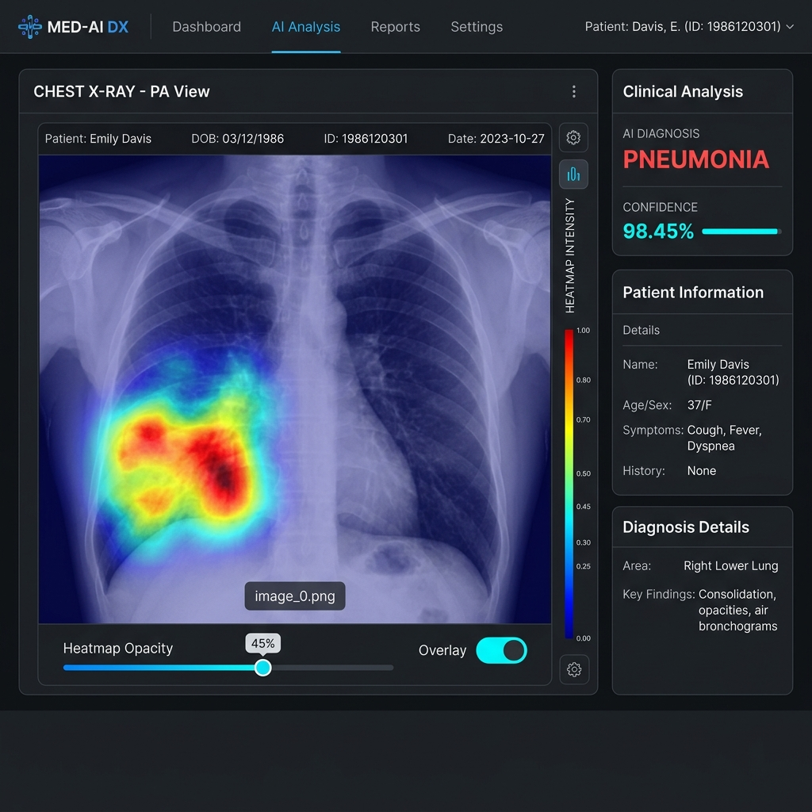

# 📑 6일차 AI 폐렴 예측 API 설계 (Pneumonia Prediction API Design)
## 프로젝트명: 흉부 X-Ray AI 진단 서비스 (Chest X-Ray AI Diagnosis Service)

본 문서는 **흉부 X-Ray AI 진단 서비스**의 6일차 AI 폐렴 예측 API 설계안입니다.
작성한 PyTorch CNN 모델(`worker/model.py`)을 활용하여, 저장된 진료 기록의 X-Ray 이미지를 기반으로 폐렴 여부를 예측하고 분석 결과를 관리하는 API 명세입니다.

---

## 🔗 API 목록 (Table of Contents)

| 연관 요구사항 | API 이름 | 메서드 | 엔드포인트 | 인증 필요 | 설명 |
| :--- | :--- | :---: | :--- | :---: | :--- |
| **[REQ-PNEU-001]** | [1. AI 폐렴 예측 실행 API](#1-ai-폐렴-예측-실행-api) | `POST` | `/api/v1/medical-records/{record_id}/predict` | Y | 특정 진료 기록의 X-Ray 분석 및 DB 저장 |
| **[REQ-PNEU-002]** | [2. AI 폐렴 예측 결과 조회 API](#2-ai-폐렴-예측-결과-조회-api) | `GET` | `/api/v1/medical-records/{record_id}/analyses` | Y | 특정 진료 기록의 기존 분석 결과 목록 조회 (배열) |
| **[REQ-PNEU-003]** | [3. AI 폐렴 즉시 예측 API (업로드)](#3-ai-폐렴-즉시-예측-api-업로드) | `POST` | `/api/v1/pneumonia/predict/upload` | Y | 이미지 업로드 즉시 폐렴 분석 및 반환 (DB 저장 안 함) |
| **[REQ-PNEU-004]** | [4. AI 폐렴 통합 예측 API (ID/환자 기반)](#4-ai-폐렴-통합-예측-api-id환자-기반) | `POST` | `/api/v1/pneumonia/predict` | Y | 진료 기록 ID 또는 환자 ID를 활용한 예측 수행 및 저장 |

---

## 1. AI 폐렴 예측 실행 API

### 1.1 API 개요
* **설명**: 특정 진료 기록 ID(`record_id`)에 등록된 X-Ray 이미지 파일을 로드하여 `SimpleCNN` 모델로 분석을 수행합니다. 분석된 폐렴 여부와 확신도(Confidence) 등의 결과는 `ai_analysis_results` 테이블에 저장하고 반환합니다.
* **엔드포인트**: `/api/v1/medical-records/{record_id}/predict`
* **메서드**: `POST`
* **인증 필요**: Y (의료진/직원 사용자)

### 1.2 요청(Request)
* **경로 파라미터**:

| 파라미터명 | 타입 | 필수 | 설명 |
| --- | --- | --- | --- |
| record_id | integer | Y | AI 분석을 수행할 진료 기록 ID |

### 1.3 응답(Response)
* **성공 (200 OK)**:
```json
{
  "id": 1,
  "record_id": 12,
  "is_pneumonia": true,
  "confidence": 98.45,
  "heatmap_url": "/media/heatmap/record_12.png",
  "ai_model": "SimpleCNN",
  "created_at": "2026-06-08T16:50:00",
  "updated_at": "2026-06-08T16:50:00"
}
```

* **실패 (404 Not Found)**:
  * `진료 기록 ID가 존재하지 않습니다.`
  * `진료 기록에 등록된 X-Ray 이미지가 없습니다.`
  * `X-Ray 이미지 파일이 서버에 존재하지 않습니다.`

---

## 2. AI 폐렴 예측 결과 조회 API

### 2.1 API 개요
* **설명**: 특정 진료 기록 ID(`record_id`)에 대해 이미 생성되어 있는 AI 분석 결과 목록을 배열 형태로 조회합니다. 분석 결과가 없을 경우 빈 배열(`[]`)을 반환합니다.
* **엔드포인트**: `/api/v1/medical-records/{record_id}/analyses`
* **메서드**: `GET`
* **인증 필요**: Y (내부 사용자 전체)

### 2.2 요청(Request)
* **경로 파라미터**:

| 파라미터명 | 타입 | 필수 | 설명 |
| --- | --- | --- | --- |
| record_id | integer | Y | 기존 분석 결과를 조회할 진료 기록 ID |

### 2.3 응답(Response)
* **성공 (200 OK)**:
```json
[
  {
    "id": 1,
    "record_id": 12,
    "is_pneumonia": true,
    "confidence": 98.45,
    "heatmap_url": "/media/heatmap/record_12.png",
    "ai_model": "SimpleCNN",
    "created_at": "2026-06-08T16:50:00",
    "updated_at": "2026-06-08T16:50:00"
  }
]
```

* **실패 (404 Not Found)**:
  * `진료 기록 ID가 존재하지 않습니다.`

---

## 3. AI 폐렴 즉시 예측 API (업로드)

### 3.1 API 개요
* **설명**: 흉부 X-Ray 이미지 파일을 직접 업로드하여 DB 저장 과정 없이 실시간으로 AI 폐렴 분석 결과를 리턴받아 화면에 표시합니다.
* **엔드포인트**: `/api/v1/pneumonia/predict/upload`
* **메서드**: `POST`
* **인증 필요**: Y (의료진/직원 사용자)

### 3.2 요청(Request)
* **Headers**: `Content-Type: multipart/form-data`
* **Body**:

| 파라미터명 | 타입 | 필수 | 설명 |
| --- | --- | --- | --- |
| file | file | Y | 폐렴 분석용 흉부 X-Ray 이미지 파일 (PNG, JPG, JPEG 등) |

### 3.3 응답(Response)
* **성공 (200 OK)**:
```json
{
  "prediction": "PNEUMONIA",
  "confidence": 98.45,
  "probability_normal": 1.55,
  "probability_pneumonia": 98.45
}
```

* **실패 (400 Bad Request)**:
  * `지원되지 않는 이미지 포맷입니다.`
  * `비어 있는 파일입니다.`

---

## 4. AI 폐렴 통합 예측 API (ID/환자 기반)

### 4.1 API 개요
* **설명**: Query Parameter로 진료 기록 ID(`record_id`) 또는 환자 ID(`patient_id`) 중 하나를 전달받아 폐렴 예측 분석을 실행하고 저장합니다.
  * `record_id` 지정 시: 해당 진료 기록의 X-Ray 이미지를 기반으로 즉시 분석을 수행합니다.
  * `patient_id` 지정 시: 해당 환자의 **가장 최신(가장 최근 등록된) 진료 기록**을 자동으로 조회하여 분석을 수행합니다.
  * 두 값 모두 누락된 경우 `400 Bad Request` 에러를 반환합니다.
* **엔드포인트**: `/api/v1/pneumonia/predict`
* **메서드**: `POST`
* **인증 필요**: Y (의료진/직원 사용자)

### 4.2 요청(Request)
* **쿼리 파라미터**:

| 파라미터명 | 타입 | 필수 | 설명 |
| --- | --- | --- | --- |
| record_id | integer | N | AI 분석을 수행할 진료 기록 ID |
| patient_id | integer | N | 가장 최신 진료 기록을 조회할 환자 ID |

### 4.3 응답(Response)
* **성공 (200 OK)**:
```json
{
  "id": 5,
  "record_id": 11,
  "is_pneumonia": false,
  "confidence": 88.50,
  "heatmap_url": "/media/heatmap/record_11_abc123.png",
  "ai_model": "SimpleCNN",
  "created_at": "2026-06-12T18:30:00",
  "updated_at": "2026-06-12T18:30:00"
}
```

* **실패**:
  * `400 Bad Request` (두 파라미터가 모두 누락된 경우: `record_id 또는 patient_id 중 하나는 필수입니다.`)
  * `404 Not Found` (해당하는 진료 기록이나 환자 정보가 없는 경우: `해당 환자의 진료 기록이 존재하지 않습니다.`)

---

## 5. Grad-CAM 기술 사양 및 프론트엔드 시각화 가이드

### 5.1 Grad-CAM (Gradient-weighted Class Activation Mapping) 원리
본 서비스는 AI의 판독 신뢰성을 높이기 위해 **설명 가능한 AI (XAI)** 기술인 Grad-CAM을 제공합니다.
* **레이어 타겟팅**: `SimpleCNN` 모델의 마지막 컨볼루션 레이어(`model.conv[3]`)의 활성화 맵(Feature Map)을 타겟으로 합니다.
* **그라디언트 캡처**: 순전파를 통해 폐렴 점수(Score)를 계산하고 역전파 시 해당 활성화 맵에 흐르는 그라디언트를 계산해 가중치를 얻습니다.
* **히트맵 생성**: 수집된 가중치와 활성화 맵을 가중합한 후, 양의 활성화 영역만 추출하는 ReLU 연산을 적용하여 최종 히트맵을 생성합니다.
* **저장 및 제공**: 히트맵은 원본 흉부 X-ray와 오버레이(투명도 45%)되어 `/media/heatmap/record_{record_id}.png` 경로에 저장됩니다.

### 5.2 프론트엔드 UI/UX 시각화 권장 사양
프론트엔드에서는 의료진이 병변 의심 부위를 직관적으로 판별할 수 있도록 아래와 같은 UI 구성을 구현하는 것을 강력히 권장합니다.

1. **원본 X-ray 및 Heatmap 오버레이 레이아웃**
   * CSS `absolute` 포지셔닝을 사용하여 원본 X-ray 이미지 위에 히트맵 이미지를 동일 크기로 정확하게 겹쳐서 배치합니다.
2. **실시간 투명도(Opacity) 슬라이더 컨트롤**
   * HTML `<input type="range" min="0" max="100">` 슬라이더를 배치하여 사용자가 히트맵 이미지의 투명도(CSS `opacity`)를 실시간 조절할 수 있도록 합니다.
3. **히트맵 토글 및 범례 레전드 제공**
   * 히트맵을 즉시 켜고 끌 수 있는 토글 스위치와 히트맵의 강도(빨강 = 높은 의심도, 파랑 = 낮은 의심도)를 설명해 주는 컬러 바 레전드를 표시합니다.
4. **반응형 상세 요약 정보 및 세로 배치 (텍스트 잘림 해결)**
   * 좁은 화면 해상도나 긴 텍스트에서 ID, 차트번호, 등록일, 증상(symptoms) 정보가 잘리거나 일그러지는 현상을 방지하기 위해 상단 영역은 수직형 Flexbox Column 구조(`display: flex; flex-direction: column`)로 정렬합니다.
   * 증상 텍스트의 줄바꿈과 여백을 확보하기 위해 `white-space: pre-wrap` 속성 및 연한 회색 백그라운드 카드 레이아웃을 사용합니다.
   * X-Ray 뷰어 이미지 및 Grad-CAM 컨트롤 카드 등의 대형 비주얼 컴포넌트는 해당 텍스트 설명 영역 하단에 완전한 여백(`margin-top: 2rem`)을 두고 배치하여 UI 겹침 현상을 완벽히 방지합니다.

#### 🎨 프론트엔드 시각화 UI 구현 예시 (Dark Mode Mockup)


#### 💻 HTML/CSS 오버레이 구현 참고 코드
```html
<div class="xray-viewer">
  <!-- 1. 원본 X-ray 이미지 -->
  
  <!-- 2. AI Grad-CAM 히트맵 이미지 (투명도 조절 대상) -->
  
</div>

<!-- 3. Opacity 조절 슬라이더 및 토글 -->
<div class="controls">
  <label for="opacity-slider">Heatmap Opacity:</label>
  <input type="range" id="opacity-slider" min="0" max="100" value="45">
</div>

<style>
.xray-viewer {
  position: relative;
  width: 500px;
  height: 500px;
}
.base-image {
  width: 100%;
  height: 100%;
  object-fit: cover;
}
.heatmap-image {
  position: absolute;
  top: 0;
  left: 0;
  width: 100%;
  height: 100%;
  object-fit: cover;
  opacity: 0.45; /* 슬라이더 값에 따라 JS로 실시간 조절 */
  mix-blend-mode: screen; /* 히트맵 오버레이 퀄리티를 높이기 위한 블렌드 모드 */
  pointer-events: none;
}
</style>

<script>
const slider = document.getElementById('opacity-slider');
const heatmap = document.getElementById('heatmap-layer');

slider.addEventListener('input', (e) => {
  heatmap.style.opacity = e.target.value / 100;
});
</script>

### 5.3 경과 비교 관찰용 Swipe Slider 시각화 설계 (경과 모니터링)
여러 시점의 AI 예측 결과를 다중 선택(3개 이상 선택 가능)하여, 팝업 모달창에서 드롭다운으로 비교 대상들을 실시간으로 자유롭게 변경해가며 마우스 슬라이더(Swipe)를 통해 실시간으로 병변 경과를 관찰할 수 있는 인터랙티브 UI 설계 규격입니다.

1. **다중 선택 활성화**:
   - 예측 결과 목록 테이블 첫 번째 열에 체크박스를 추가하고, 최소 2개 이상 선택될 때 `[경과 비교하기]` 버튼을 활성화합니다.
2. **비교 대상 실시간 드롭다운 매핑**:
   - 팝업 모달 상단에 좌측 영역(검사 A)과 우측 영역(검사 B)을 매핑할 수 있는 드롭다운 메뉴를 배치하여, 모달 창을 닫지 않고도 원하는 시점의 검사 결과를 자유롭게 교체하여 비교할 수 있도록 합니다.
3. **CSS clip-path 기반 Swipe Slider 인터랙션**:
   - 두 히트맵 이미지를 absolute 포지셔닝으로 완전히 겹쳐 얹고, 마우스/터치 드래그에 따라 CSS 변수 `--slider-pos`를 실시간 업데이트합니다.
   - 상위에 올라간 이미지 래퍼(검사 B)에 `clip-path: inset(0 0 0 var(--slider-pos))`를 부여하여, 슬라이더 왼쪽 영역은 아래의 이미지(검사 A)가 비치고 오른쪽 영역은 검사 B가 보이도록 클리핑하여 실시간 Swipe Slider 인터랙션을 제공합니다.
