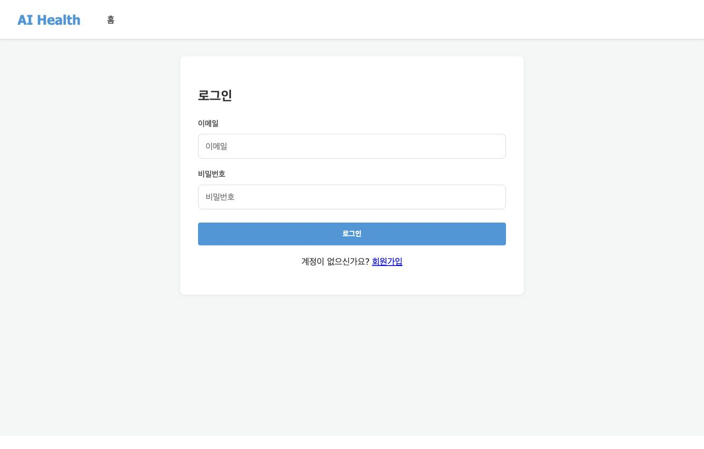
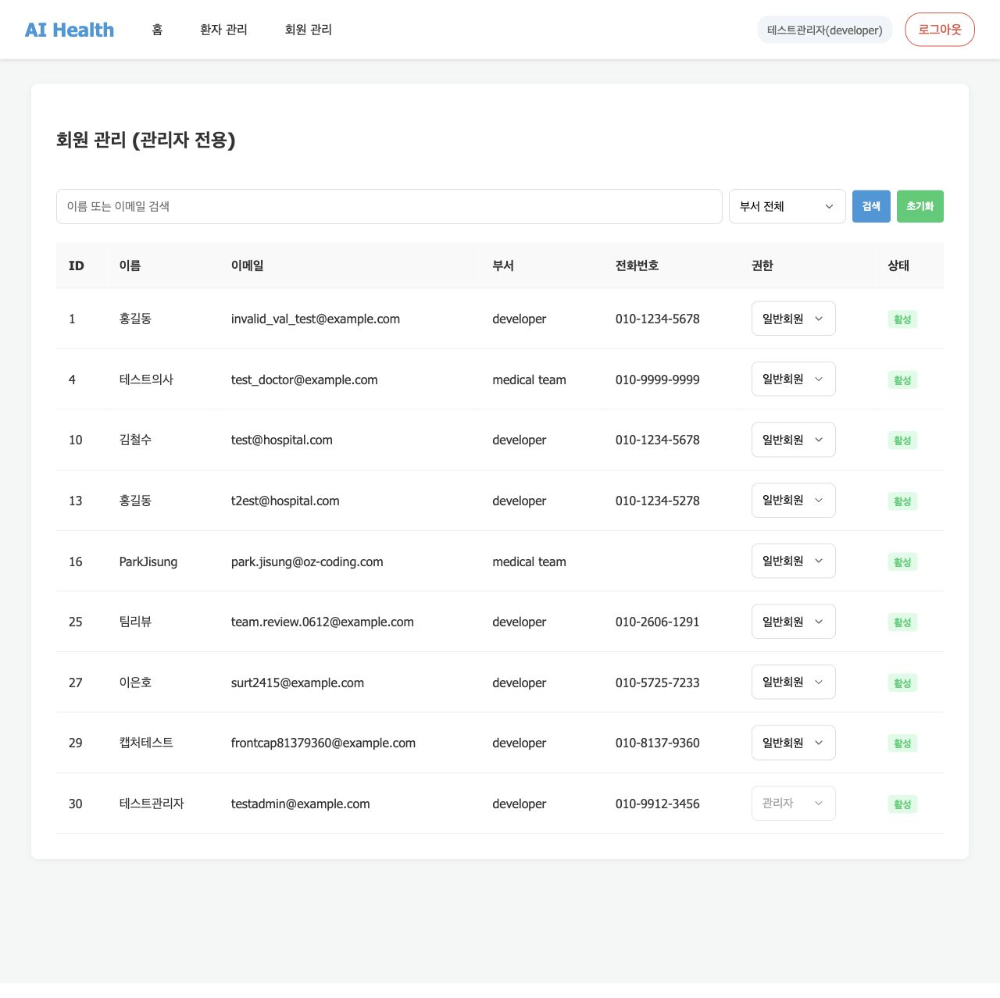
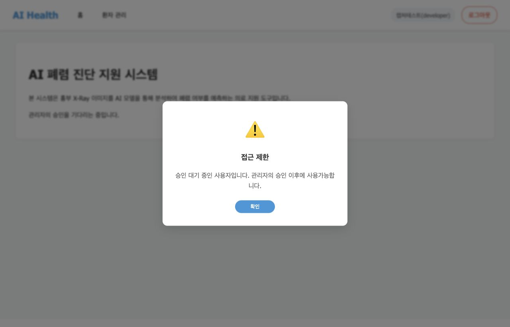
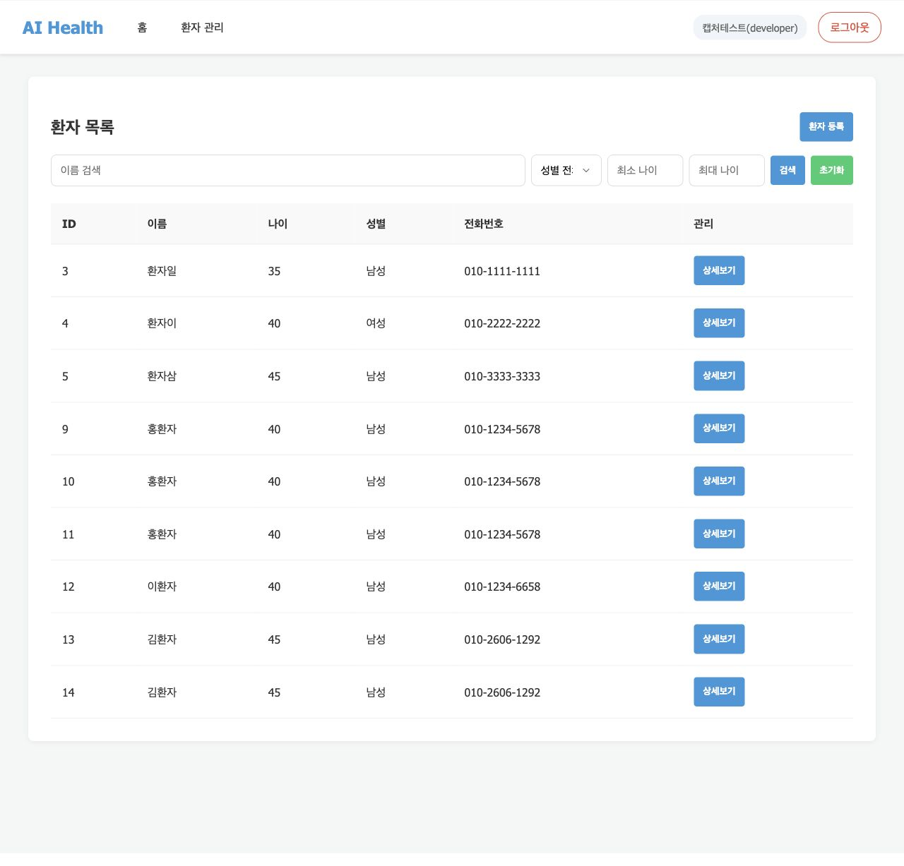
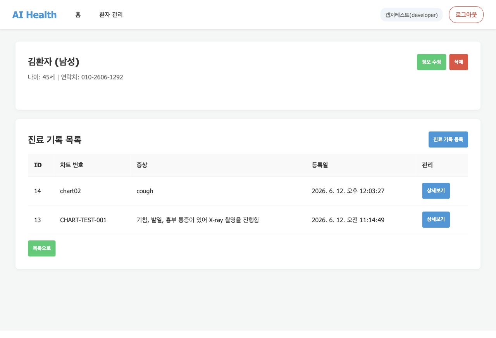
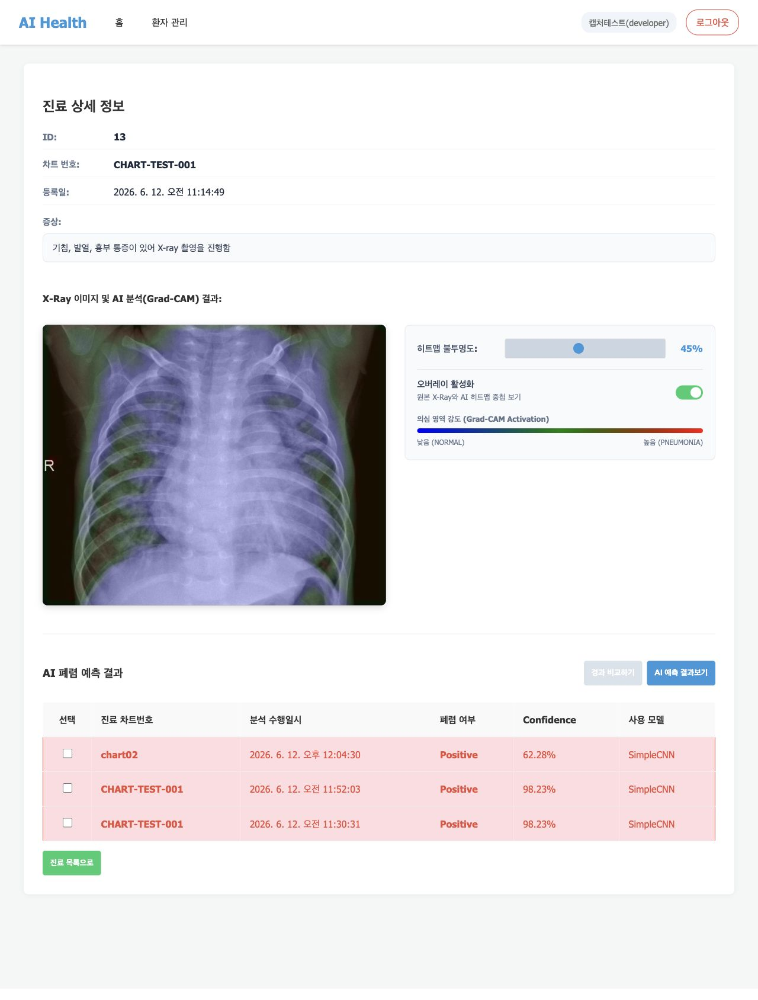
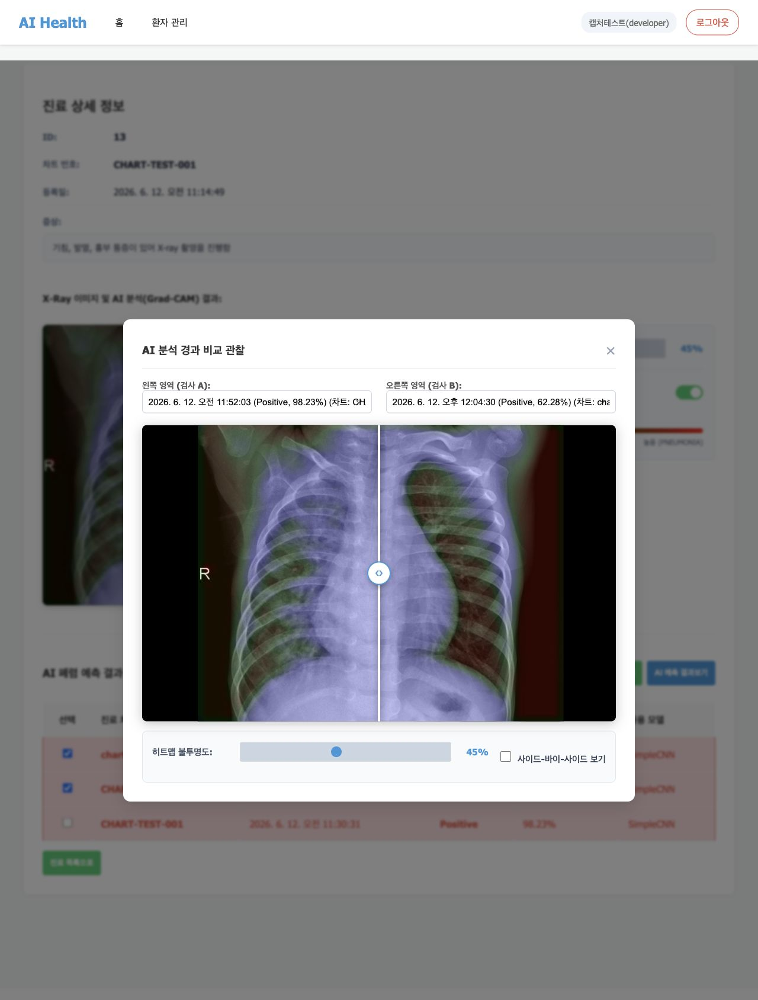

# 7일차 앱 실행화면 정리

## 1. 문서 목적

이 문서는 7일차 미션인 `프론트 템플릿코드에 API 연결하기` 완료 확인을 위해 작성했습니다.

FastAPI 앱을 실행한 뒤 프론트엔드 화면에서 User API, 환자/진료기록 API, 폐렴 예측 API가 실제로 연결되어 동작하는지 확인했습니다.

## 2. 실행 방법

```bash
uv run fastapi dev app/main.py --host 127.0.0.1 --port 8001
```

브라우저 접속 주소:

```text
http://127.0.0.1:8001/
```

## 3. 테스트 계정 및 권한 흐름

회원가입한 사용자는 기본적으로 `pending` 권한을 받습니다. `pending` 사용자는 환자/진료기록/폐렴 예측 화면에 접근할 수 없으며, 관리자 승인이 필요합니다.

이번 점검에서는 테스트용 관리자 계정을 생성한 뒤, 캡처용 일반 계정을 `staff` 권한으로 승인하여 화면을 확인했습니다.

| 계정 | 용도 | 확인 내용 |
| --- | --- | --- |
| `testadmin@example.com` | 관리자 계정 | 회원 관리 화면 접근, 사용자 권한 변경 가능 |
| `frontcap81379360@example.com` | 캡처용 일반 계정 | 승인 후 환자/진료기록/폐렴 예측 화면 접근 가능 |

보안상 문서에는 비밀번호를 기록하지 않습니다.

## 4. 화면별 확인 결과

### 4.1 로그인 화면

- 연결 API: `POST /api/v1/users/login`
- 확인 내용:
  - 이메일과 비밀번호 입력 후 로그인 가능
  - 로그인 성공 시 토큰이 저장되고 보호된 화면으로 이동



### 4.2 관리자 회원 관리 및 승인 화면

- 연결 API:
  - `GET /api/v1/admin/users`
  - `PATCH /api/v1/admin/users/role`
- 확인 내용:
  - 관리자 계정으로 로그인하면 `회원 관리` 메뉴가 표시됨
  - 회원 목록에서 `pending`, `staff`, `admin` 권한을 확인할 수 있음
  - 캡처용 계정이 `staff` 권한으로 승인된 것을 확인함



### 4.3 승인 대기 사용자의 접근 제한

- 확인 내용:
  - `pending` 사용자는 환자 관리 화면에 접근할 수 없음
  - 접근 시 승인 대기 안내 메시지가 표시됨



### 4.4 환자 목록 화면

- 연결 API: `GET /api/v1/patients`
- 확인 내용:
  - 승인된 사용자는 환자 목록 화면에 접근 가능
  - 환자 ID, 이름, 나이, 성별, 전화번호가 표시됨
  - 상세보기 버튼을 통해 환자 상세 화면으로 이동 가능



### 4.5 환자 상세 및 진료기록 목록 화면

- 연결 API:
  - `GET /api/v1/patients/{patient_id}`
  - `GET /api/v1/patients/{patient_id}/medical-records`
- 확인 내용:
  - 환자 기본 정보가 표시됨
  - 환자에게 연결된 진료기록 목록이 표시됨
  - 진료기록 상세 화면으로 이동 가능



### 4.6 진료기록 상세 및 폐렴 예측 결과 화면

- 연결 API:
  - `GET /api/v1/medical-records/{record_id}`
  - `GET /api/v1/patients/{patient_id}/pneumonia/analyses`
  - `POST /api/v1/medical-records/{record_id}/predict`
- 확인 내용:
  - 진료기록의 차트 번호, 증상, 등록일이 표시됨
  - X-Ray 이미지와 Grad-CAM 히트맵이 표시됨
  - AI 폐렴 예측 결과 목록이 표시됨
  - confidence, 폐렴 여부, 사용 모델이 화면에 표시됨



### 4.7 AI 분석 경과 비교 화면

- 연결 API: `GET /api/v1/patients/{patient_id}/pneumonia/analyses`
- 확인 내용:
  - 같은 환자의 여러 AI 분석 결과 중 2개를 선택하면 `경과 비교하기` 버튼이 활성화됨
  - 비교 모달에서 두 분석 결과의 X-Ray와 Grad-CAM 히트맵을 함께 확인 가능
  - 히트맵 불투명도 조절 UI가 표시됨



## 5. 최종 확인

- [x] 프론트 화면에서 로그인 API가 정상 동작함
- [x] 관리자 승인 흐름을 통해 `pending` 사용자를 `staff`로 변경 가능함
- [x] 승인된 사용자가 환자 목록과 환자 상세 화면에 접근 가능함
- [x] 진료기록 상세 화면에서 X-Ray 이미지와 AI 분석 결과가 표시됨
- [x] 폐렴 예측 결과와 Grad-CAM 히트맵이 화면에 표시됨
- [x] AI 분석 경과 비교 모달이 정상적으로 열림

## 6. 남은 참고사항

- `POST /api/v1/users/refresh`는 아직 서버 라우터가 없으므로, 이번 테스트는 토큰 만료 전 일반 사용 흐름 기준으로 확인했습니다.
- 테스트 DB에는 과제 진행 중 생성한 환자/진료기록 데이터가 남아 있어 목록에 같은 이름의 환자가 여러 명 표시될 수 있습니다.
- 도커 배포 후 새 DB에서 시작할 때는 첫 가입자가 자동으로 `admin` 권한을 받으므로, 첫 계정으로 로그인해 다른 팀원 계정을 승인하면 됩니다.
