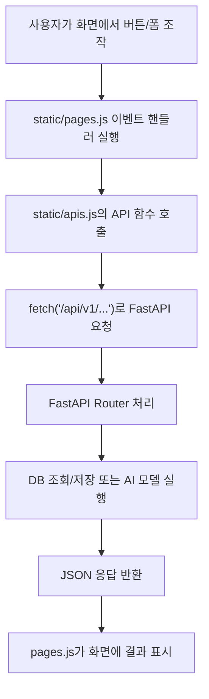
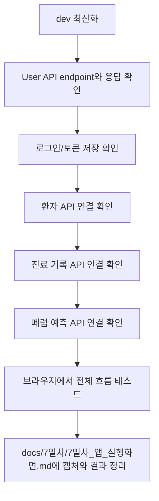

# 7일차 프론트엔드 API 연결 준비 문서

## 1. 문서 목적

이 문서는 7일차 미션인 `프론트 템플릿코드에 API 연결하기`를 진행하기 전에, 현재 프론트엔드 코드가 기대하는 API 형태를 미리 정리하기 위한 문서입니다.

아직 User API와 폐렴 예측 API가 개발 중이므로, 이 문서에서는 실제 연결 코드를 확정하지 않고 다음 항목만 정리합니다.

- 현재 프론트 코드가 호출하고 있는 API 주소
- API별 요청 형식과 응답에서 필요한 필드
- 담당 API가 dev에 병합될 때 확인해야 할 체크리스트
- 환자 관리 및 진료 기록 API의 예상 명세

## 2. 현재 프론트 코드 구조

| 파일 | 역할 |
| --- | --- |
| `static/apis.js` | 백엔드 API 호출 함수 모음 |
| `static/pages.js` | 화면 렌더링과 버튼/폼 이벤트 처리 |
| `static/app.js` | 라우팅, 로그인 상태, 토큰 상태 관리 |
| `static/templates/*.html` | 각 화면의 HTML 템플릿 |

프론트 API 호출의 기본 주소는 `static/apis.js`의 `API_BASE = "/api/v1"`입니다.

따라서 `apis.request("/patients")`는 실제로 `GET /api/v1/patients`를 호출합니다.

## 3. 전체 연결 흐름



## 4. 담당 API 병합 전 공통 확인사항

각 API 담당자는 PR 설명 또는 코멘트에 아래 정보를 같이 남기면 프론트 연결이 쉬워집니다.

| 항목 | 설명 |
| --- | --- |
| API 이름 | 예: 회원가입, 로그인, 환자 등록 |
| Method | `GET`, `POST`, `PATCH`, `DELETE` |
| Endpoint | 예: `/api/v1/users/signup` |
| 인증 필요 여부 | 토큰이 필요한지 여부 |
| Request Body | JSON인지, FormData인지, Query Parameter인지 |
| Response Body | 프론트에서 사용할 필드 이름 |
| Swagger 테스트 결과 | 성공/실패 케이스 확인 여부 |

## 5. User API 연결 준비

User API는 팀원 담당 API가 최종 dev에 병합된 뒤 실제 연결을 확정합니다.

현재 프론트가 기대하는 User API는 다음과 같습니다.

| 화면/기능 | 프론트 함수 | Method | 기대 Endpoint | 요청 형식 | 비고 |
| --- | --- | --- | --- | --- | --- |
| 이메일 중복 확인 | `apis.checkEmail(email)` | `GET` | `/api/v1/users/check-email?email=...` | Query | 현재 코드는 임시로 `/practice_api/users/check-email`을 호출 중이므로 User API 병합 후 수정 필요 |
| 회원가입 | `apis.signup(userData)` | `POST` | `/api/v1/users/signup` | JSON | 프론트는 `name`을 보내지 않고 `last_name`, `first_name`, `middle_name`을 보냄 |
| 로그인 | `apis.login(email, password)` | `POST` | `/api/v1/users/login` | FormData | 응답에 `access_token` 필요 |
| 토큰 갱신 | `apis.refresh()` | `POST` | `/api/v1/users/refresh` | Cookie 또는 JSON | 구현 방식 확정 필요 |
| 로그아웃 | `apis.logout()` | `POST` | `/api/v1/users/logout` | Header | 토큰 기반 처리 방식 확정 필요 |
| 내 정보 조회 | `apis.getMe()` | `GET` | `/api/v1/users/me` | Header | `state.user` 갱신에 사용 |
| 내 정보 수정 | `apis.updateMe(userData)` | `PATCH` | `/api/v1/users/me` | JSON | 부서, 전화번호 수정 |
| 비밀번호 변경 | `apis.updatePassword(passwordData)` | `PATCH` | `/api/v1/users/me/password` | JSON | 현재 비밀번호와 새 비밀번호 |
| 회원 탈퇴 | `apis.deleteMe()` | `DELETE` | `/api/v1/users/me` | Header | 구현 범위 확인 필요 |
| 관리자 유저 목록 | `apis.adminGetUsers(params)` | `GET` | `/api/v1/admin/users` | Query | 관리자 권한 필요 |
| 관리자 권한 수정 | `apis.adminUpdateUserRole(roleData)` | `PATCH` | `/api/v1/admin/users/role` | JSON | 관리자 권한 필요 |

### User API 응답에서 프론트가 기대하는 필드

로그인 후 `state.user`에는 최소한 다음 필드가 필요합니다.

```json
{
  "id": 1,
  "email": "staff@example.com",
  "name": "홍길동",
  "department": "medical team",
  "gender": "male",
  "phone_number": "01012345678",
  "role": "staff",
  "is_active": true
}
```

## 6. 환자 관리 API 연결 준비

환자 관리 API는 현재 프론트 화면이 이미 준비되어 있습니다.

| 화면/기능 | 프론트 함수 | Method | Endpoint | 요청 형식 | 응답에서 필요한 필드 |
| --- | --- | --- | --- | --- | --- |
| 환자 등록 | `apis.createPatient(patientData)` | `POST` | `/api/v1/patients` | JSON | 생성된 환자 정보 |
| 환자 목록 조회 | `apis.getPatients(params)` | `GET` | `/api/v1/patients` | Query | 환자 배열 |
| 환자 상세 조회 | `apis.getPatient(patientId)` | `GET` | `/api/v1/patients/{patient_id}` | Path | 환자 1명 정보 |
| 환자 정보 수정 | `apis.updatePatient(patientId, patientData)` | `PATCH` | `/api/v1/patients/{patient_id}` | JSON | 수정된 환자 정보 |
| 환자 삭제 | `apis.deletePatient(patientId)` | `DELETE` | `/api/v1/patients/{patient_id}` | Path | 삭제 메시지 |

### 환자 등록 Request Body

현재 프론트는 환자 등록 시 다음 JSON을 보냅니다.

```json
{
  "name": "홍길동",
  "age": 45,
  "gender": "male",
  "phone_number": "01012345678"
}
```

### 환자 응답에서 프론트가 기대하는 필드

```json
{
  "id": 1,
  "name": "홍길동",
  "age": 45,
  "gender": "male",
  "phone_number": "01012345678",
  "created_at": "2026-06-09T10:00:00",
  "updated_at": "2026-06-09T10:00:00"
}
```

주의: DB 모델의 컬럼명은 `patients.phone`이지만, 프론트 응답 필드는 `phone_number`를 기대합니다. 백엔드에서 응답 스키마로 `phone`을 `phone_number`로 변환해주면 프론트 수정이 줄어듭니다.

## 7. 진료 기록 API 연결 준비

진료 기록 API는 `feature/patient-record-api`에서 작성한 구현 기준으로 미리 정리합니다.

| 화면/기능 | 프론트 함수 | Method | Endpoint | 요청 형식 | 응답에서 필요한 필드 |
| --- | --- | --- | --- | --- | --- |
| 진료 기록 등록 | `apis.createMedicalRecord(formData)` | `POST` | `/api/v1/medical-records` | `multipart/form-data` | 생성된 진료 기록 |
| 환자별 진료 기록 조회 | `apis.getPatientMedicalRecords(patientId)` | `GET` | `/api/v1/patients/{patient_id}/medical-records` | Path | 진료 기록 배열 |
| 진료 기록 상세 조회 | `apis.getMedicalRecord(recordId)` | `GET` | `/api/v1/medical-records/{record_id}` | Path | 진료 기록 1개 |
| 진료 기록 수정 | 미연결 | `PATCH` | `/api/v1/medical-records/{record_id}` | JSON | 수정된 진료 기록 |
| 진료 기록별 AI 결과 조회 | `apis.getMedicalRecordAnalyses(recordId)` | `GET` | `/api/v1/medical-records/{record_id}/analyses` | Path | AI 분석 결과 배열 |

### 진료 기록 등록 FormData

현재 프론트는 진료 기록 등록 시 다음 값을 `FormData`로 보냅니다.

| 필드 | 현재 프론트 전송 여부 | 설명 |
| --- | --- | --- |
| `patient_id` | Y | URL의 환자 ID를 FormData에 추가 |
| `chart_number` | Y | 차트 번호 |
| `symptoms` | Y | 증상 |
| `xray_image` | Y | 업로드 이미지 파일 |
| `shooting_datetime` | N | 현재 프론트에는 촬영 일시 입력란이 없음 |
| `uploader_id` | N | User API 인증 연결 후 토큰에서 사용자 정보를 가져오는 방향 추천 |

User API가 완성되면 `uploader_id`를 프론트에서 직접 보내기보다 백엔드에서 `Depends(get_current_user)`로 현재 로그인 사용자를 확인해 저장하는 방향이 좋습니다.

### 진료 기록 응답에서 프론트가 기대하는 필드

```json
{
  "id": 1,
  "patient_id": 1,
  "chart_number": "CHART-20260609-001",
  "symptoms": "기침, 발열",
  "xray_image_url": "/media/xray_images/record_1.png",
  "shooting_datetime": "2026-06-09T10:00:00",
  "created_at": "2026-06-09T10:05:00",
  "updated_at": "2026-06-09T10:05:00"
}
```

## 8. 폐렴 예측 API 연결 준비

폐렴 예측 API는 팀원 담당 API가 dev에 병합된 뒤 실제 endpoint와 요청 형식을 확정합니다.

현재 프론트가 기대하는 기본 형태는 다음과 같습니다.

| 화면/기능 | 프론트 함수 | Method | 기대 Endpoint | 요청 형식 | 비고 |
| --- | --- | --- | --- | --- | --- |
| 폐렴 예측 실행 | `apis.predictPneumonia(recordId)` | `POST` | `/api/v1/medical-records/{record_id}/predict` | Path | 진료 기록에 연결된 X-Ray 이미지 사용 |
| 예측 결과 조회 | `apis.getMedicalRecordAnalyses(recordId)` | `GET` | `/api/v1/medical-records/{record_id}/analyses` | Path | 진료 상세 화면에서 표시 |

### AI 분석 결과 응답에서 프론트가 기대하는 필드

```json
[
  {
    "id": 1,
    "record_id": 1,
    "is_pneumonia": true,
    "confidence": 93.24,
    "heatmap_url": "/media/heatmaps/result_1.png",
    "ai_model": "pneumonia-model-v1",
    "created_at": "2026-06-09T10:10:00",
    "updated_at": "2026-06-09T10:10:00"
  }
]
```

주의: `static/pages.js`는 `confidence`를 그대로 `%`와 함께 표시합니다. 백엔드가 `0.93`으로 내려주면 화면에는 `0.93%`로 보일 수 있으므로, `93.24`처럼 퍼센트 값으로 내려줄지, 프론트에서 변환할지 미리 정해야 합니다.

## 9. API 병합 후 실제 연결 순서



## 10. 브라우저 테스트 시나리오 초안

| 순서 | 화면 | 확인할 동작 |
| --- | --- | --- |
| 1 | 회원가입 | 정상 입력 시 계정 생성 |
| 2 | 로그인 | 로그인 성공 후 토큰 저장 및 환자 목록 이동 |
| 3 | 관리자 승인 | pending 사용자를 staff/admin으로 변경 |
| 4 | 환자 등록 | 신규 환자 생성 후 목록에서 확인 |
| 5 | 환자 목록 | 이름, 성별, 나이 필터 확인 |
| 6 | 환자 상세 | 환자 기본 정보와 진료 기록 목록 확인 |
| 7 | 진료 기록 등록 | 차트번호, 증상, X-Ray 이미지 업로드 |
| 8 | 진료 기록 상세 | X-Ray 이미지와 기본 정보 확인 |
| 9 | 폐렴 예측 | 예측 실행 후 결과 목록 표시 |
| 10 | 실패 케이스 | 잘못된 입력, 없는 ID, 권한 없음 확인 |

## 11. 남은 결정 사항

| 항목 | 결정 필요 내용 |
| --- | --- |
| User API endpoint | 설계서 기준 `/api/v1/users/...`로 맞출지 최종 확인 |
| 이메일 중복 확인 | `/practice_api` 임시 호출을 User API로 교체 |
| 토큰 저장 방식 | Access Token은 현재 `localStorage` 사용, Refresh Token은 구현 방식 확인 필요 |
| 환자 삭제 정책 | 진료 기록이 있는 환자 삭제 제한 여부 |
| 진료 기록 이미지 | `uploader_id`를 직접 보낼지, 인증 사용자로 대체할지 |
| 폐렴 예측 confidence | `0~1` 값인지 `0~100` 퍼센트 값인지 |
| 촬영 일시 | 프론트에 입력 필드를 추가할지, 백엔드에서 현재 시각 기본값을 쓸지 |

