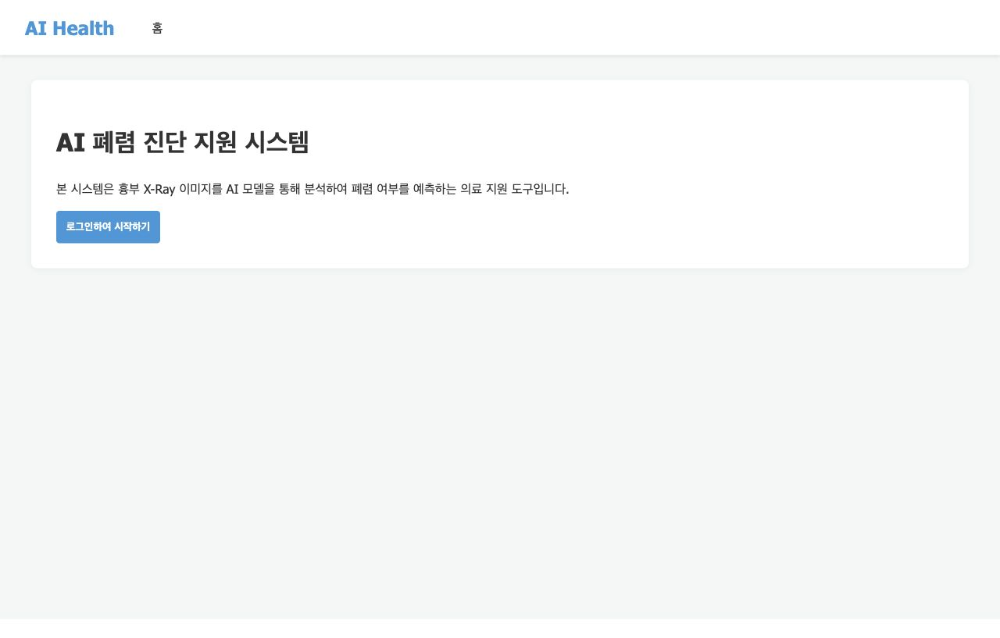
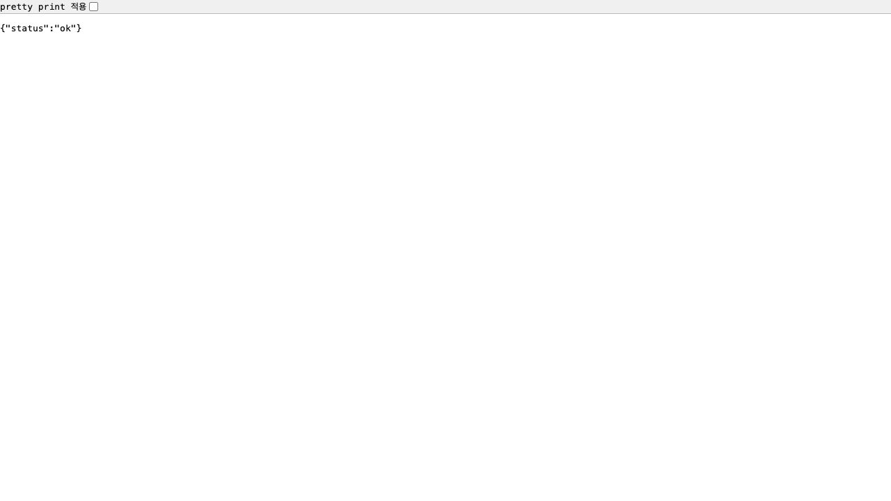

# 8일차 Docker 실행 확인

## 작업 내용

- `app/Dockerfile`을 작성하여 FastAPI 앱 이미지를 빌드할 수 있도록 구성했습니다.
- `.dockerignore`와 `app/.dockerignore`를 작성하여 보안 파일과 불필요한 파일이 이미지 빌드 컨텍스트에 포함되지 않도록 정리했습니다.
- Docker 이미지 빌드 후 컨테이너를 실행하고, FastAPI 앱 응답을 확인했습니다.

## 사용한 명령어

```bash
docker build -f app/Dockerfile -t ai-health-fastapi:step1 .
docker run --rm -d --name ai-health-fastapi-step1 -p 8001:8000 ai-health-fastapi:step1
curl http://127.0.0.1:8001/healthcheck
```

## 확인 결과

- 이미지 빌드: 성공
- 생성 이미지: `ai-health-fastapi:step1`
- 컨테이너 실행: 성공
- 포트 매핑: `127.0.0.1:8001` -> 컨테이너 내부 `8000`
- Healthcheck 응답:

```json
{"status":"ok"}
```

> 참고: 폐렴 예측 기능 때문에 `torch`, `torchvision` 의존성이 포함되어 이미지 용량이 크게 생성됩니다. 이번 단계에서는 빌드/실행 성공을 우선했고, 이미지 경량화는 이후 배포 최적화 단계에서 별도로 다룰 수 있습니다.

## 실행 화면 캡처

### FastAPI 앱 실행 화면



### Healthcheck 응답 화면


