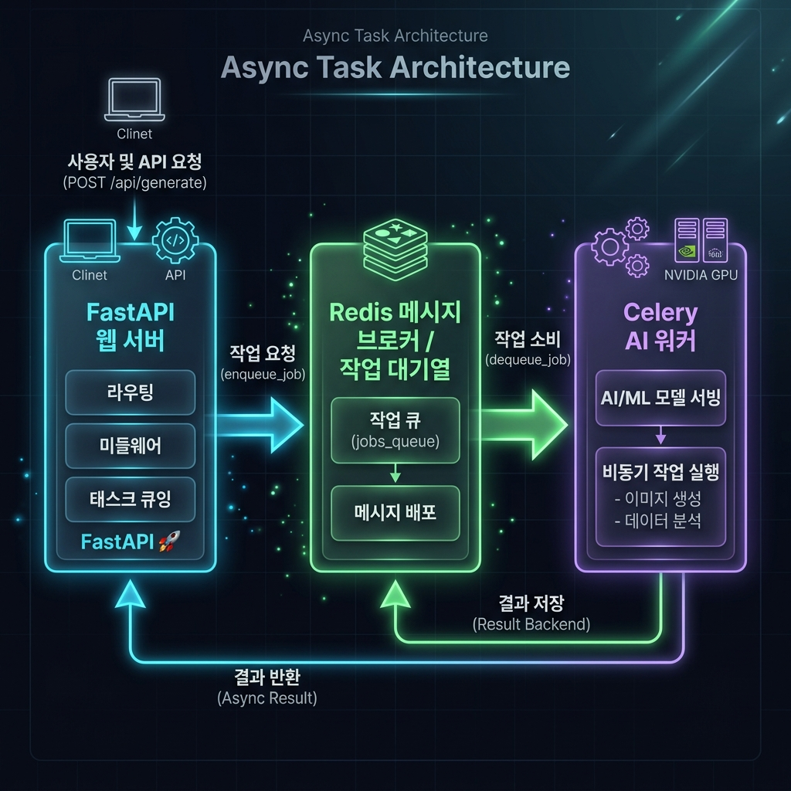
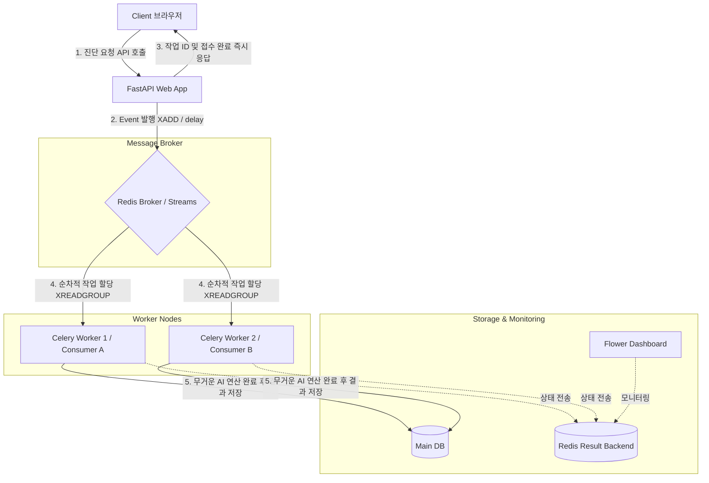

# 9일차: 동시성 문제 해결을 위한 이벤트 기반 아키텍처(EDA) 설계

웹 서비스에서 AI 분석 모델 실행이나 대용량 이미지 처리와 같이 시간이 오래 걸리는 작업을 효율적으로 처리하려면, 서버의 자원을 효율적으로 분배하고 작업이 누락되지 않도록 설계해야 합니다.

본 문서는 FastAPI 웹 서버의 동시성 저하 문제를 해결하기 위해 Redis와 Celery를 활용한 **이벤트 기반 아키텍처(Event-Driven Architecture, EDA)**를 설계하고, 사용되는 핵심 기술 용어와 동작 메커니즘을 쉽게 이해할 수 있도록 정리한 자료입니다.

---

## 1. FastAPI 동시성 처리의 한계와 필요성

FastAPI는 비동기(Async) 기반으로 높은 성능을 내지만, 특정 상황에서는 전체 시스템이 멈추거나 요청이 유실되는 한계가 있습니다.

### 1.1. CPU-Bound 블로킹 문제

- **원인**: FastAPI의 이벤트 루프(Event Loop)는 하나의 스레드에서 다수의 가벼운 요청(I/O 작업)을 빠르게 번갈아 처리합니다. 그러나 AI 모델 진단 연산처럼 CPU 코어를 많이 사용하는 **무거운 연산(CPU-Bound 작업)**을 수행하면 이벤트 루프 자체가 멈추게(Blocking) 됩니다.
- **현상**: 한 명의 사용자가 AI 진단 요청을 보내어 연산이 도는 동안, 다른 모든 사용자는 페이지 접속이나 로그인 등 가벼운 요청조차 처리되지 않고 대기 상태에 빠집니다.

### 1.2. 내장 백그라운드 처리의 한계

FastAPI 내장 기능인 `BackgroundTasks`나 파이썬 표준 `asyncio.create_task`는 임시방편으로 비동기 처리를 지원하지만 프로덕션 환경에서는 한계가 명확합니다.

- **메모리 기반 대기열의 위험성**: 작업 대기열이 컴퓨터의 RAM(메모리)에만 존재하기 때문에, 웹 서버 프로세스가 재시작되거나 에러로 인해 크래시가 나면 대기 중이던 모든 작업이 즉시 유실됩니다.
- **스케일 아웃(인프라 확장)의 불가능**: 웹 서버가 가동 중인 단일 컴퓨터의 리소스만 사용할 수 있으므로, 서버 부하가 심해져 다른 컴퓨터 노드를 추가해 처리를 분산하는 방식의 확장이 불가능합니다.

---

## 2. 이벤트 기반 아키텍처(EDA) 핵심 용어 설명

이벤트 기반 아키텍처(EDA)는 시스템에서 발생한 상태 변화(이벤트)를 전달하고 소비하는 방식으로 시스템을 구성하는 형태입니다.

- **이벤트(Event)**: 시스템 내에서 발생한 중요한 상태 변화를 기록한 데이터 메시지입니다. (예: "환자 X-Ray 진단 요청 발생")
- **발행자(Publisher/Producer)**: 이벤트를 생성하여 전송하는 주체입니다. 우리 아키텍처에서는 사용자의 요청을 접수하는 **FastAPI 웹 서버**가 발행자가 됩니다.
- **소비자(Consumer/Worker)**: 발행된 이벤트를 전달받아 실제 비즈니스 로직을 수행하는 주체입니다. 여기서는 AI 진단 연산을 수행하는 **Celery 워커**가 소비자입니다.
- **메시지 브로커(Message Broker)**: 발행자와 소비자 사이에서 이벤트 메시지를 임시로 보관하고 안전하게 전달해 주는 중개 시스템입니다. **Redis**가 메시지 브로커 역할을 수행합니다.
- **작업 대기열(Task Queue)**: 메시지 브로커 내부에서 소비자가 작업을 가져가기 전까지 메시지들이 순서대로 정렬하여 대기하는 버퍼 공간입니다.

---

## 3. Redis Streams의 핵심 용어 및 동작 프로세스

Redis Streams는 Redis 5.0부터 도입된 기능으로, 시간 순서대로 데이터를 누적하여 보관하는 구조를 가집니다. 경량 메시지 브로커로서 매우 높은 성능을 냅니다.

### 3.1. 핵심 용어 정리

- **Stream (스트림)**: 이벤트 데이터가 들어온 시간 순서대로 계속 추가되는 로그 형태의 데이터 구조입니다.
- **Consumer Group (컨슈머 그룹)**: 동일한 스트림의 이벤트를 여러 개의 소비자가 중복 없이 나누어 처리할 수 있도록 묶어놓은 소비자 연합입니다.
- **ACK (Acknowledgment, 승인)**: 소비자가 메시지를 성공적으로 처리했음을 브로커에게 명시적으로 보고하는 신호입니다. ACK 보고를 받아야 Redis가 대기열에서 해당 메시지를 완전히 안전한 상태로 분류합니다.
- **PEL (Pending Entries List, 보류 목록)**: 소비자가 메시지를 가져갔으나, 아직 처리 완료 신호(ACK)를 브로커에 보내지 않은 채 머물러 있는 임시 보류 메시지 목록입니다. 워커 장애 시 복구를 위해 활용됩니다.
- **XAUTOCLAIM**: 특정 워커가 메시지를 가져간 후 장애(크래시 등)로 인해 일정 시간 동안 ACK를 보내지 못하고 방치될 경우, 다른 정상적인 워커가 해당 메시지의 소유권을 가져와 다시 처리할 수 있도록 보장하는 재요청 명령어입니다.

### 3.2. Redis Streams의 동작 프로세스

1. **발행 (`XADD`)**: FastAPI 웹 서버가 요청 데이터를 실시간으로 스트림에 추가합니다. 이때 스트림의 최대 용량(`maxlen`)을 제한해 메모리 과부하를 예방합니다.
2. **그룹 생성 (`XGROUP CREATE`)**: 애플리케이션 시작 시 스트림과 컨슈머 그룹을 생성하여 중복 처리 방지 기반을 마련합니다.
3. **소비 (`XREADGROUP`)**: 대기 중인 워커 프로세스가 자신의 이름으로 그룹에서 아직 처리되지 않은 신규 메시지(`>`: 다른 소비자에게 가기 전 메시지)를 꺼내와 처리를 시작합니다.
4. **확정 (`XACK`)**: 처리가 완료되면 워커가 해당 메시지 ID로 ACK를 전송해 보류 목록(PEL)에서 완벽히 해제합니다.
5. **재청구 (`XAUTOCLAIM`)**: 처리 중 실패하여 멈춘 작업이 있는지 보류 목록을 상시 감시하고, 방치된 작업을 정상 워커로 가져와 장애를 자동 복구합니다.

---

## 4. Celery 분산 비동기 큐 핵심 용어 및 아키텍처

Celery는 파이썬 환경에서 비동기 작업 대기열을 관리하고 분산 처리하기 위해 사용하는 신뢰성 높은 라이브러리 프레임워크입니다.

### 4.1. 핵심 용어 정리

- **Celery Application**: 비동기 작업을 정의하고, 브로커 및 백엔드 설정을 제어하는 Celery의 메인 인스턴스입니다.
- **Task (태스크)**: 백그라운드에서 실행되도록 디자인된 개별 작업 단위 함수입니다. `@app.task` 데코레이터를 사용하여 등록합니다.
- **Result Backend (결과 백엔드)**: 실행 완료된 태스크의 성공/실패 상태 정보와 최종 반환된 결과값을 임시 보관해두는 데이터 저장소(Redis, 데이터베이스 등)입니다.
- **Flower (플라워)**: Celery가 관리하는 워커와 태스크들의 실시간 실행 상태, 에러 발생률, 큐 상태 등을 시각적인 웹 화면으로 모니터링할 수 있게 돕는 대시보드 도구입니다.
- **Chaining (체이닝)**: 여러 개의 태스크를 연결하여 파이프라인 구조로 순차 실행하는 기법입니다. (예: `음성 파일 다운로드` $\rightarrow$ `텍스트 변환` $\rightarrow$ `키워드 추출` 순차 실행)

### 4.2. Celery 분산 비동기 큐의 동작 프로세스

1. **비동기 호출**: FastAPI가 태스크 함수 뒤에 `.delay()` 등을 호출하여 작업을 예약하면 즉시 고유한 작업 ID(Task ID)가 반환되고 API 응답이 끝납니다.
2. **메시지 중개**: 예약된 작업의 매개변수와 메타데이터가 Redis(Broker)의 작업 큐에 저장됩니다.
3. **독립 워커 실행**: 백그라운드에서 실행 중인 Celery Worker 프로세스들이 큐에서 메시지를 풀링(Pulling)하여 파이썬 코드를 실행합니다.
4. **상태 기록**: 작업이 종료되면 성공/실패 여부와 결과 데이터를 결과 백엔드(Result Backend)에 업데이트합니다.
5. **모니터링**: Flower 도구가 결과 백엔드의 실시간 데이터를 읽어와 웹 GUI 화면에 상태를 시각화합니다.

---

## 5. 도커(Docker) 기반 다중 컨테이너 및 환경의 이해

본 아키텍처는 **FastAPI**, **Redis**, **Celery 워커**가 독립된 가상 OS 환경인 **도커 컨테이너(Docker Container)**로 분리되어 가동됩니다. 도커를 학습하는 과정에서 아래 세 가지 개념의 흐름을 파악하는 것이 중요합니다.

```
       [외부망 (인터넷)]
              │  (포트 포워딩 8000 -> 8000)
              ▼
    ┌────────────────────────────────── 도커 가상 네트워크 (bridge) ─────────────────────────────────────┐
    │                                                                                                  │
    │  ┌────────────────────────┐    (DNS 조회: "redis")    ┌────────────────────────┐                 │
    │  │   FastAPI 컨테이너      │ ─────────────────────────>│    Redis 컨테이너       │                 │
    │  │  (호스트포트: 8000)      │  (내부망 통신: 포트 6379)  │  (내부포트: 6379)       │                 │
    │  └────────────────────────┘                          └────────────────────────┘                 │
    │                                                                     ▲                            │
    │                                                                     │ (태스크 polling)            │
    │                                                        ┌────────────────────────┐                 │
    │                                                        │   Celery 워커 컨테이너   │                 │
    │                                                        │  (호스트와 포트 연결X)   │                 │
    │                                                        └────────────────────────┘                 │
    │                                                                                                  │
    └──────────────────────────────────────────────────────────────────────────────────────────────────┘
```

### 5.1. 컨테이너 간의 네트워크 통신과 내부 DNS

- **문제점**: 각 컨테이너는 격리된 네트워크 환경을 가지므로, 서로의 내부 IP 주소를 미리 알 수 없습니다.
- **해결책**: 도커 컴포즈(Docker Compose)는 컨테이너들을 하나의 **가상 네트워크(Bridge Network)**로 묶어줍니다. 이 망 내부에서는 컨테이너의 서비스 이름이 **도메인 네임(Host Name)** 역할을 합니다.
- **실제 예시**: FastAPI 코드에서 Redis 브로커 주소를 설정할 때 `localhost`나 무작위 IP 주소 대신, `redis://redis:6379`와 같이 **서비스 이름(`redis`)을 입력**하여 안전하게 찾아갈 수 있습니다.

### 5.2. 호스트 포트 바인딩 (Port Binding)

- **내부망 전용 포트**: Redis 컨테이너는 컨테이너 내부 포트 `6379`번을 사용하여 통신하지만, 굳이 컴퓨터 외부망(공공 인터넷)으로 이 포트를 열어둘 필요가 없습니다. 도커 내부 네트워크 안에서 FastAPI와 워커만 Redis에 붙으면 되기 때문입니다.
- **외부 노출 포트**: 사용자가 브라우저로 접속해야 하는 FastAPI(`8000`포트)와 모니터링 대시보드인 Flower(`5555`포트)만 외부 호스트 포트와 포트 포워딩(Port Binding) 설정을 통해 인터넷망에 노출시킵니다.

### 5.3. 볼륨 마운트(Volume Mount)와 데이터 영속성

- **도커의 단점**: 컨테이너가 에러나 강제 종료로 삭제되면, 컨테이너 내부에 쓰였던 임시 데이터도 함께 영구 유실됩니다.
- **해결책**: 이를 막기 위해 컴퓨터 본체의 실제 하드디스크 디렉터리와 컨테이너의 내부 폴더를 연결하는 **볼륨 마운트**를 적용합니다.
- **실제 예시**: `docker-compose.yml`에서 Redis 데이터를 보관하는 내부 `/data` 폴더를 본체 하드의 `redis_data` 볼륨에 마운트해 두면, Redis 컨테이너가 켜지고 꺼지는 것에 무관하게 대기열 작업 목록이 안전하게 유지됩니다.

---

## 6. 비동기 백그라운드 솔루션 상세 비교

웹 서비스의 규모와 성격에 맞춰 적절한 솔루션을 선택해야 합니다.

| 비교 항목         | FastAPI BackgroundTasks       | asyncio.create_task                  | Redis Streams                         | Celery + Redis                                 |
| :---------------- | :---------------------------- | :----------------------------------- | :------------------------------------ | :--------------------------------------------- |
| **인프라 종속성** | 없음 (완전 내장)              | 없음 (Python 표준)                   | Redis 필요                            | Redis + Celery Worker 필요                     |
| **데이터 영속성** | 메모리 기반 (유실 가능)       | 메모리 기반 (유실 가능)              | 디스크 백업 가능 (안전)               | 브로커 설정에 따라 보장 (매우 안전)            |
| **스케일 아웃**   | 불가능                        | 불가능                               | 가능 (컨슈머 그룹 단위)               | 가능 (분산 독립 워커 그룹)                     |
| **작업 모니터링** | 불가능 (커스텀 개발 필요)     | 불가능                               | CLI/Redis 커맨드로 확인 가능          | Flower 웹 대시보드로 실시간 확인 가능          |
| **추천 시나리오** | 가벼운 이메일 전송, 로그 기록 | 간단한 비동기 I/O 호출, 웹 소켓 통신 | 고성능/저지연 경량 EDA 시스템 구축 시 | 복잡한 워크플로우 제어, AI 모델 추론, 스케줄링 |

---

## 7. 아키텍처 다이어그램

### 7.1. 아키텍처 개념도 (Excalidraw 설계)

FastAPI 웹 서버와 AI 워커(Worker)의 작업을 물리적으로 명확히 격리하고, Redis를 메시지 브로커 및 작업 대기열(Task Queue)로 활용하여 설계한 동시성 해결 아키텍처 도식입니다.



### 7.2. 상세 컴포넌트 흐름도 (Mermaid)

이벤트 기반 아키텍처를 도입했을 때 요청의 수명 주기와 각 컴포넌트 간 상호작용 흐름은 다음과 같습니다.



---

## 8. 결론 및 향후 적용 계획

우리 2조의 폐렴 진단 예측 API 및 AI 태스크 처리 구조에 있어서, 로컬/CPU 기반 진단 연산으로 인한 **웹 서버 병목 현상을 방지**하기 위해 본 이벤트 기반 설계 도입을 적극 검토해야 합니다.

1. **단기적 관점**: FastAPI 내부의 동시성 저하를 방지하기 위해 간단한 CPU-Bound 로직은 Redis Streams 또는 Celery를 활용해 워커 노드로 위임합니다.
2. **장기적 관점**: 서비스 확장에 맞추어 도커 컴포즈 상에 `celery_worker` 인스턴스를 확장하고 `Flower` 모니터링을 통해 진단 대기열의 상태와 에러율을 모니터링하며 부하를 분산 제어합니다.
