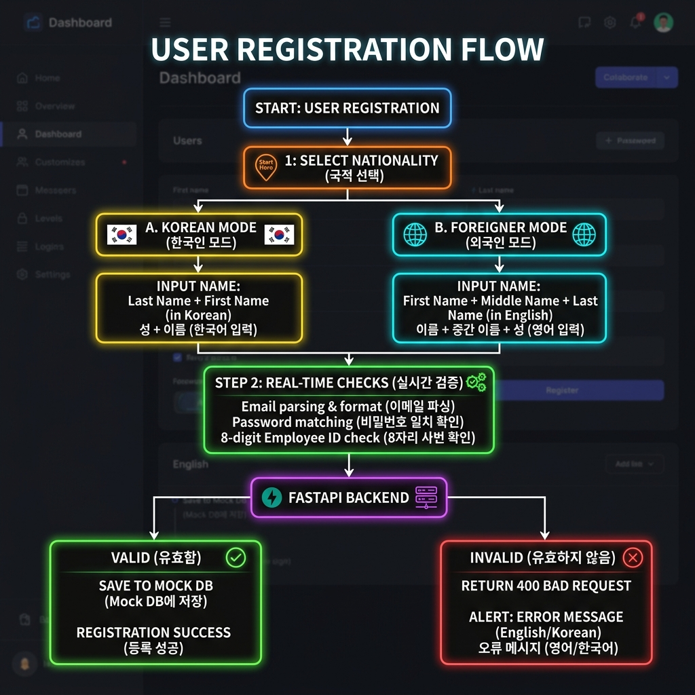
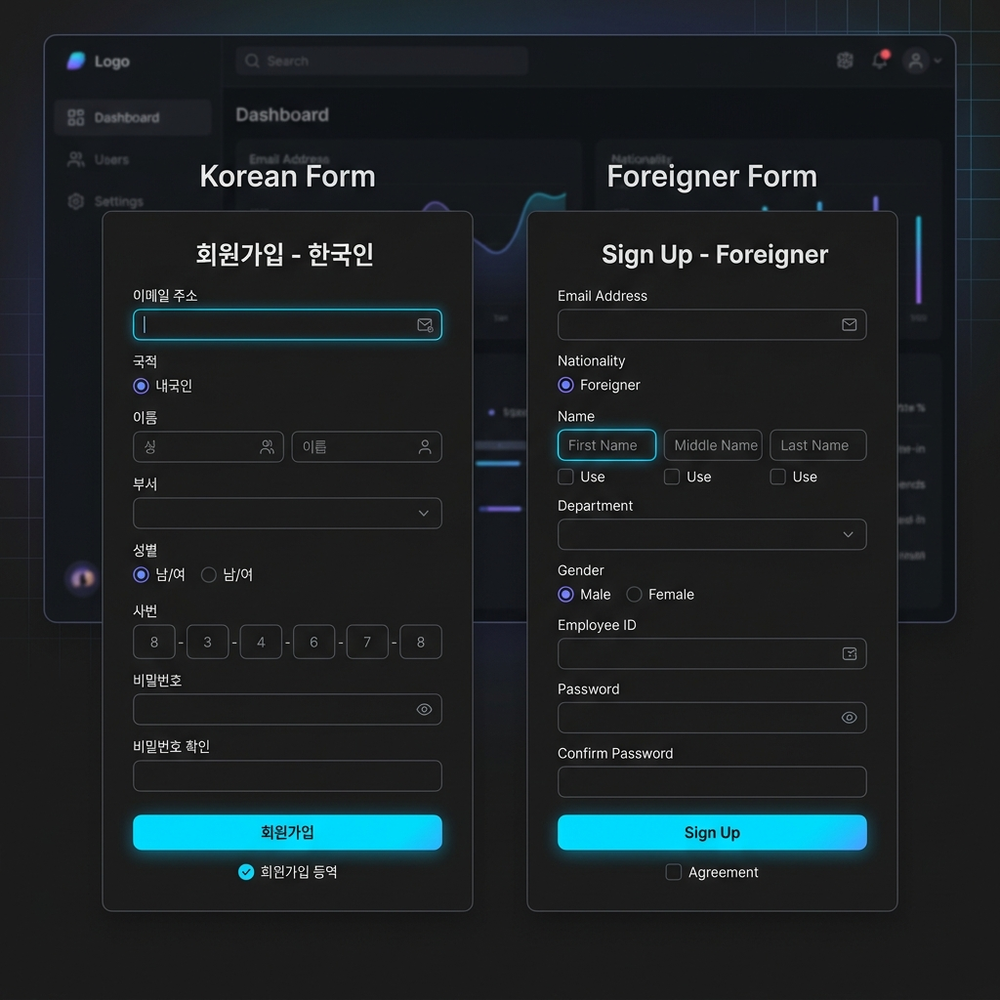
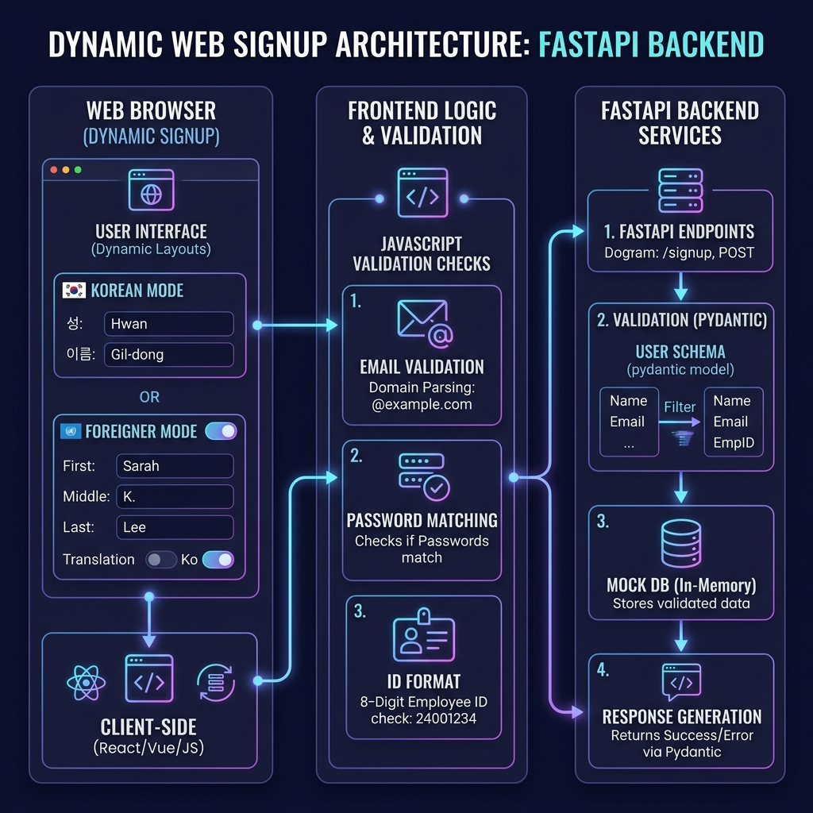

# 📝 작업 요약 보고서 (오후 3시 30분 이후 진행 내역)

본 보고서는 오늘(2026-06-02) 오후 3시 30분 이후부터 진행된 개발 환경 점검, 백엔드 API 구현 및 프론트엔드 회원가입 화면(UI/UX) 개선 작업의 상세 내역을 정리한 문서입니다.

---

## 📊 아키텍처 및 작업 흐름도

회원가입의 다국어 레이아웃 제어 및 백엔드 API 연동 흐름을 직관적으로 이해하기 위한 시각 자료입니다.

### 1. 흐름도 (Workflow Flowchart)

### 2. 회원가입 UI/UX 구성도 (UI Layout Mockup)

### 3. 전체 아키텍처 다이어그램 (Generated Architecture)

---

## 📂 작업 대상 파일

* **백엔드 파일**
  * [practice_apis.py](../app/apis/practice_apis.py) `[NEW]`
  * [main.py](../app/main.py) `[MODIFY]`
* **프론트엔드 파일**
  * [signup.html](../static/templates/signup.html) `[MODIFY]`
  * [pages.js](../static/pages.js) `[MODIFY]`
  * [styles.css](../static/styles.css) `[MODIFY]`
* **테스트 파일**
  * [test_api.py](../test_api.py) `[NEW]`

---

## 🛠️ 작업 단계별 상세 내역

### 1. 개발 환경 순차 점검
* **Git 및 Python 설치 상태 확인**: 시스템에 `Git 2.54.0` 및 `Python 3.13.9`, 패키지 매니저 `uv 0.11.16`이 올바르게 설치되어 있음을 검증했습니다.
* **가상환경 의존성 및 활성화 체크**: `uv sync`를 통해 생성된 `.venv` 내에 `fastapi`, `sqlalchemy`, `uvicorn` 등이 정상 탑재되어 있음을 확인하고, 활성화 시 가상환경 내부의 Python 인터프리터 경로가 최우선 순위로 잡히는 것을 테스트했습니다.

### 2. 연습용 회원 관리 API 구현
`user_list` 리스트를 임시 데이터베이스로 활용하여 요구사항에 맞춤 설계된 3개의 API를 구현했습니다.
* **`GET /practice_api/users` (전체 조회)**: 모든 회원의 정보를 조회하되, 비밀번호(`password`) 필드는 Pydantic의 `response_model` 기능을 통해 클라이언트에 노출되지 않도록 필터링했습니다.
* **`GET /practice_api/users/{user_id}` (단일 조회)**: 특정 사용자의 정보를 조회하며, 유효하지 않은 ID일 경우 `404 Not Found` 에러를 반환합니다.
* **`POST /practice_api/users` (회원 등록)**:
  * ID 자동 증가 기능 구현.
  * 이름(2~10자), 나이(14세 이상), 이메일(형식 정규식 체크 및 중복 방지), 비밀번호(대소문자/숫자/특수문자 필수 포함, 8~20자) 유효성 검사 수행.
  * **사번 중복 검증**: 동일한 사번을 가진 사람이 중복 가입하지 못하도록 사번 포맷(8자리 숫자) 및 고유성 검증 로직 추가.

### 3. 회원가입 화면(UI/UX) 기능 고도화
회원가입의 편의성 및 데이터 일관성을 지키기 위해 화면과 스크립트를 대대적으로 개편했습니다.

* **이메일 도메인 간편 선택 및 자동 분해 (Autofill Splitter)**
  * 이메일 아이디 입력란과 도메인 선택 드롭다운(`naver.com`, `gmail.com` 등)을 한 줄로 구성.
  * 브라우저 자동완성(Autofill)이나 복사 붙여넣기로 **전체 이메일 주소를 아이디 칸에 입력하면 자동으로 아이디와 도메인을 분할**하여 알맞은 칸에 채워 넣고 드롭다운을 설정해주는 스마트 파싱 UX 적용.
  * 가로폭 확장을 위해 회원가입 카드의 가로 크기를 `500px`에서 `560px`로 확대하고 폼 요소를 유연하게 반응하도록 설정.
* **비밀번호 일치 확인 기능**
  * `비밀번호 확인` 입력칸 추가.
  * 타이핑과 동시에 두 비밀번호가 맞는지 실시간으로 대조하여 문구 색상(초록/빨강)으로 피드백을 주는 실시간 안내 연동.
  * 일치하지 않을 시 폼 전송을 차단하는 보안 가드 구성.
* **사번(Employee Number) 필수 가입 연동**
  * 사번 입력란 추가 및 숫자 외의 기호 입력 차단 및 최대 8자 제한.
  * 8자 미만 입력 시 실시간 경고 라벨 표시 및 8자리 숫자 포맷 검증.
* **부서 및 성별 입력란 1행 정렬**
  * 부서 선택 드롭다운과 성별 선택 드롭다운을 한 줄(`flex` 행)로 정렬하여 화면 세로폭을 줄이고 컴팩트하게 리디자인.
* **국적에 따른 레이아웃 제어 및 전체 영문 변환 (Localization)**
  * `구분(내국인/외국인)` 선택창을 추가.
  * **내국인**: `성`과 `이름` 입력란이 좌우 1:1 대칭 비율로 균등 노출되며, 성과 이름 모두 필수로 지정.
  * **외국인**: 레이아웃 순서가 **[First Name] ➔ [Middle Name] ➔ [Last Name]** 순으로 자동 재배치(Flexible Order)되며, 모든 라벨, 안내문구(Placeholder), 버튼 텍스트가 **영어로 즉시 일괄 번역**되도록 처리.
  * **체크박스 기입 제어**: 외국인은 성(Last Name)과 미들네임(Middle Name)이 필수가 아니므로, **[Use(있음)] 체크박스를 체크해야만 입력창이 하얗게 활성화**되고 체크 해제 시 비활성화(회색 배경)되며 값이 초기화되는 고급 제어 UX 탑재.
  * **경고문 및 에러 메시지 현지화**: 외국인 폼 선택 상태에서 비밀번호 확인 미일치 오류 및 사번 자릿수 부족(8자리 미만) 오류 발생 시, 경고 문구와 회원가입 시 출력되는 알림창(Alert) 문구를 모두 **영문(English)으로 자동 변환**하여 노출되도록 개선했습니다. (내국인 상태에서는 기존과 같이 한글 경고가 유지됩니다.)

---

## 🧪 기능 검증 결과

개발 서버를 구동한 상태에서 시나리오별 작동 여부를 완벽하게 확인했습니다.

1. **내/외국인 스위칭**: 내국인 1:1 한글 폼 ➔ 외국인 영문 3분할 폼 순서 스왑 작동 확인.
2. **사번 및 비밀번호 실시간 경고**: 조건 불일치 시 실시간 오류 텍스트 출력 작동 확인.
3. **이메일 자동 스플릿**: `user@gmail.com`을 아이디 칸에 입력하면 아이디에 `user`만 남고 도메인은 자동으로 채워지며 select가 `gmail.com`으로 바뀌는 기능 테스트 통과.
4. **API 통합 테스트**: 사번 중복 에러(`400`), 8자리 미만 에러(`400`), 정상 등록(`200`, ID 자동 증가) 테스트 스크립트 실행 검증 완료.
